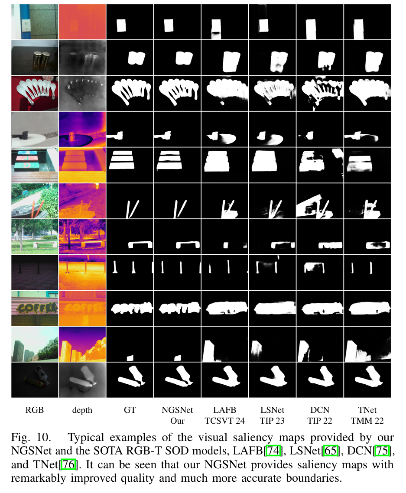

# NGSNet

This is an official implementation for "NGSNet: An NAMLab Hierarchical Image Segmentation Guided Swin Transformer Based Network for RGB-D Salient Object Detection"

## Environmental Setups

python>=3.7 pytorch>=1.13

```
conda create -n ngsnet python=3.8
conda activate ngsnet
pip install -r requirements.txt
```

### Train/Test

### Data Preparation

We provide [download link](https://pan.baidu.com/s/1dZ47EX1ttETSE3jF8Km-5w&pwd=yial) for the RGB-D dataset，[download link](https://pan.baidu.com/s/1dZ47EX1ttETSE3jF8Km-5w&pwd=yial) for the RGB-T dataset.

We randomly selected images from multiple test datasets for validation.

### Dataset Structure

```
dataset/
├─RGBD_dataset/
│ ├─train/
│ │ ├─ReDWeb-S-TR/
│ │ ├─NJUNLPR/
│ │ ├─...
│ └─test/
│   ├─NJU2K/
│   ├─STERE/
│   ├─...
└─RGBT_dataset/
  ├─train/
  │ └─RGBT_train/
  └─test/
    ├─VT821/
    ├─VI-RGBT1500/
    ├─...
```
The structure of each dataset is shown below
```
RGBT_train/
├─bound/
├─GT/
├─T/
├─RGB/
├─namlab40/ #only for train, optional
├─...
```
### pretrain

./pretrained contains several backbone pre-trained checkpoint files with their corresponding configuration files

train on multi-GPUs

```
# CUDA_VISIBLE_DEVICES=0,1,2,3 python -m torch.distributed.launch --nproc_per_node=4 distributed.py \
#     --backbone segswin-base segswin-small --texture /namlab40/ --lr 3e-4  --decay_epoch 10 --gamma 0.5 \
#     --train_batch 32 --mfusion AFM  --warmup_epoch 40 --max_epoch 100 \
#     --train_root /path/to/train/dataset --val_root /path/to/test/dataset
```

### model and log

```
path/to/log/
├─fig/
├─save/#pred maps
├─src/#src code
├─eval_result.csv
├─args.json
├─config.yaml
└─ckpt/#checkpoints
```

test 
```
python test.py --test_model /path/to/log/ --gpu_id 0
```

* **Salmaps**   

The salmaps of the above datasets can be download from [here]().

## Evaluation and Visual Analysis

refer to [SOD_Evaluation_Metrics](https://github.com/zyjwuyan/SOD_Evaluation_Metrics)

## Results
* **Qualitative comparison**  


Fig.1 Qualitative comparison of our proposed method with some RGB-D SOTA methods.  


Fig.2 Qualitative comparison of our proposed method with some RGB-T SOTA methods.

* **Quantitative comparison** 


Table.1 Quantitative comparison with some SOTA models on some public RGB-D benchmark datasets. 



Table.2 Quantitative comparison with some SOTA models on some public RGB-D benchmark datasets. 


### config NAMLAB environment

refer to [opencv-install](https://waltpeter.github.io/open-cv-basic/install-opencv-ubuntu-cpp/index.html)

refer to [matlab-install](https://blog.csdn.net/mziing/article/details/122422397)

### NAMLab boundary data preparation

refer to [NAMLab](https://github.com/YunpingZheng/NAMLab)

### convert NAMLab Hierarchical Image Segmentation map to NAMLab boundary map

```
python convertmat.py --/path/to/data --/path/to/result
```

# Related works
- TIP 23 - WaveNet: Wavelet Network With Knowledge Distillation for RGB-T Salient Object Detection [[Code](https://github.com/nowander/WaveNet)]
- TCSVT 21 - SwinNet: Swin Transformer drives edge-aware RGB-D and RGB-T salient object detection [[Code](https://github.com/liuzywen/SwinNet)]
- AAAI 20 - F3Net - F3Net: Fusion, Feedback and Focus for Salient Object Detection [[Code](https://github.com/weijun-arc/F3Net)]
- ICCV 17 - Grad-CAM: Visual Explanations from Deep Networks via Gradient-based Localization [[Code](https://github.com/jacobgil/pytorch-grad-cam)]
